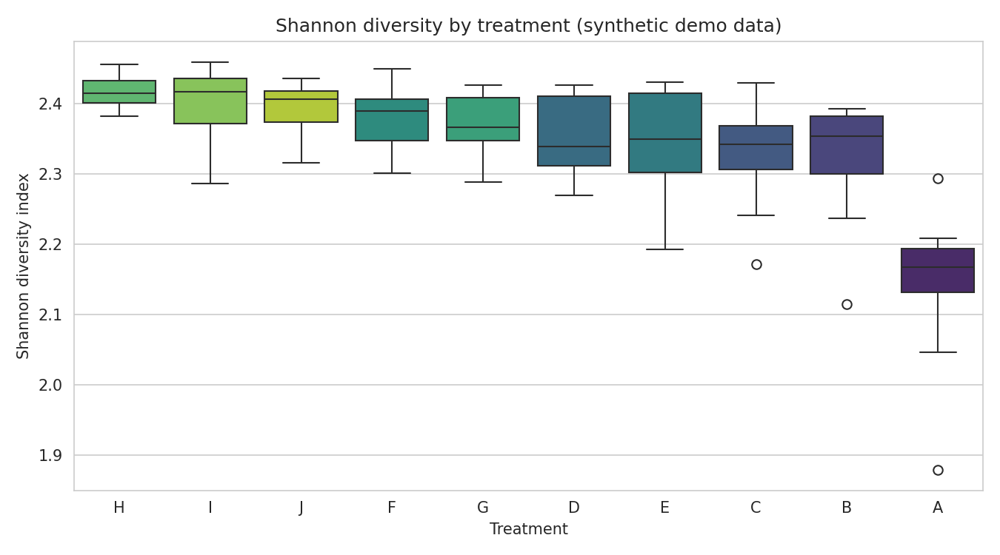
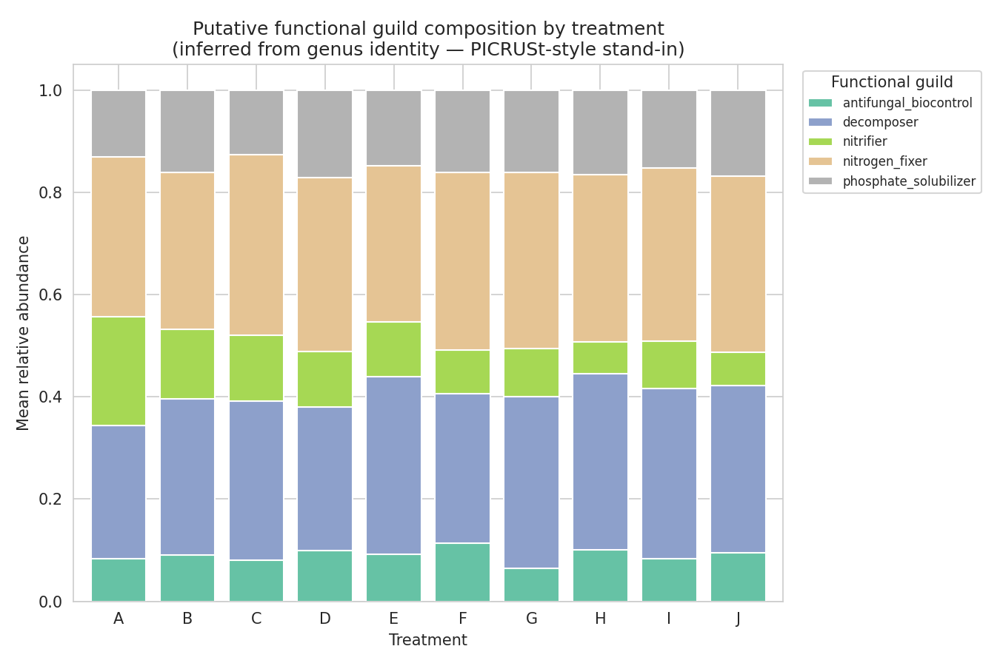
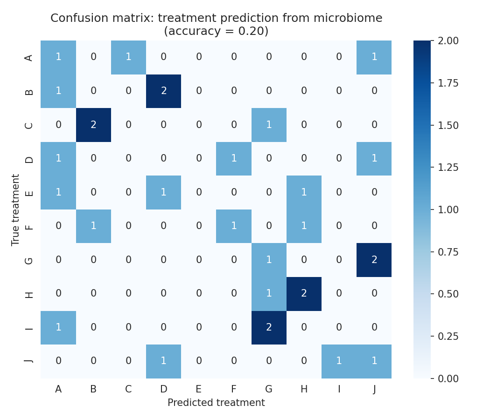
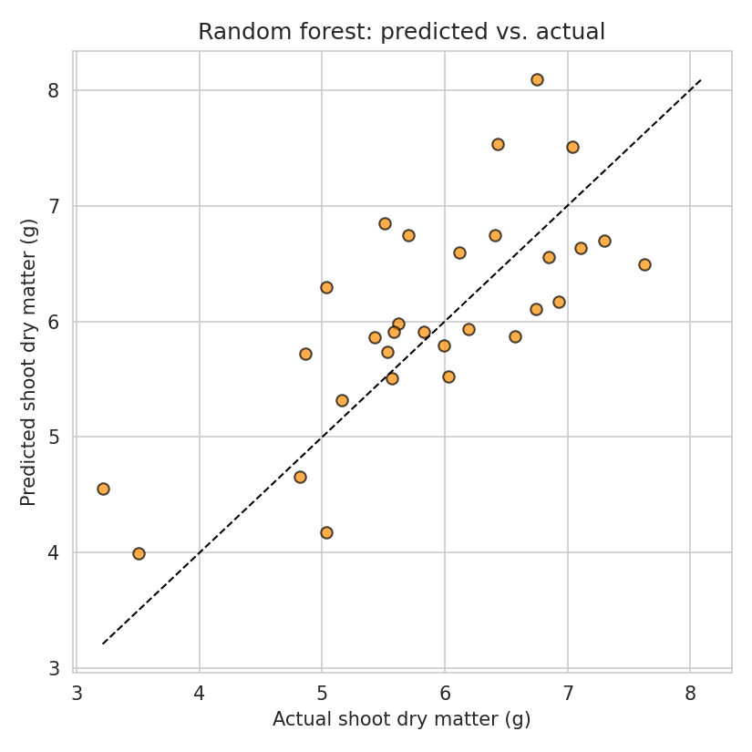
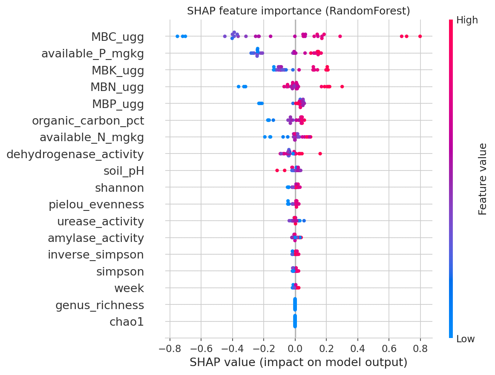
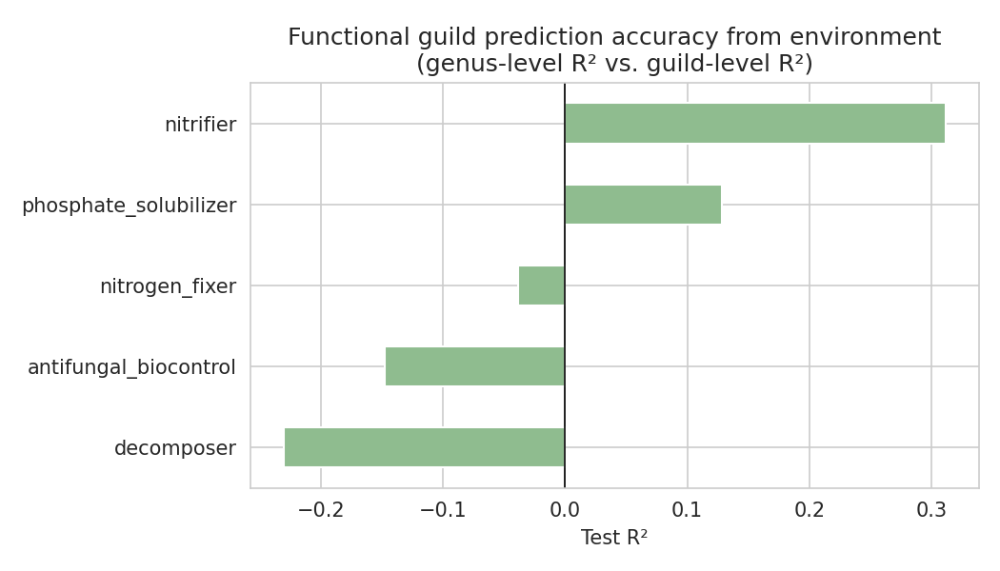

# Soil Microbiome Diversity, Function & Growth Prediction

A worked example of moving an agronomy-style amendment trial (treatments ×
replicates × sampling weeks, analysed in GenStat with ANOVA/DMRT) into a
reproducible Python pipeline: diversity indices from raw genus counts,
statistical comparison across treatments, functional-guild inference,
metagenomics-style prediction of the microbial community itself, and a
machine-learning model that predicts plant growth from soil, enzyme, and
microbial variables.

**Note on the data:** this repo ships with a *synthetic* dataset
(`data/generate_synthetic_data.py`) shaped like a real screenhouse amendment
trial, so the pipeline runs end-to-end without needing to publish
unpublished data. Genus abundances are generated with a guild-environment
coupling (see below) so the community composition carries a real, learnable
signal rather than being pure noise. Swap in your own genus abundance table
and soil physicochemical data (same column names, or edit the script) to
run it on real results.

## What this demonstrates

- Handling a genus-level abundance table and computing five alpha-diversity
  metrics (Shannon, Simpson, inverse Simpson, Chao1, Pielou's evenness)
  plus richness, directly from raw counts
- Testing treatment effects with one-way ANOVA + Tukey HSD, and a two-way
  ANOVA (treatment × week) on microbial biomass carbon
- Beta diversity (Bray-Curtis dissimilarity) and PCoA ordination
- Inferring putative functional guilds from genus identity (nitrogen-fixers,
  phosphate-solubilizers, decomposers, nitrifiers, antifungal/biocontrol
  taxa) — a lightweight stand-in for PICRUSt/Tax4Fun-style functional
  prediction from taxonomy
- Two metagenomics-style ML tasks that predict the microbes themselves,
  not just plant growth:
  - classifying which treatment a sample came from, from its genus
    fingerprint alone
  - multi-output regression predicting individual genus (and guild-level)
    relative abundance from environmental variables
- Comparing three regression models (Ridge, Random Forest, Gradient
  Boosting) for growth prediction, interpreting the best one with SHAP,
  and checking residual diagnostics rather than reporting a single R²
- A repo structured the way a reviewer expects: separated data
  generation, analysis, and outputs, with a script that runs top to
  bottom with no manual steps

## Project structure

```
portfolio-example/
├── data/
│   ├── generate_synthetic_data.py   # builds the demo dataset
│   └── soil_microbiome_data.csv     # 10 treatments × 3 reps × 4 weeks
├── analysis/
│   └── diversity_and_ml_analysis.py # diversity, ANOVA, ordination, ML
├── figures/                         # 15 figures, written on each run
├── RESULTS.md                       # auto-generated results tables
└── README.md
```

## Method summary

1. **Alpha diversity** — Shannon, Simpson, inverse Simpson, Chao1, and
   Pielou's evenness, computed directly from the raw genus count columns
   for each sample.
2. **Treatment comparison** — one-way ANOVA on Shannon diversity across
   the 10 treatments, followed by Tukey HSD. Two-way ANOVA (treatment ×
   week) on microbial biomass carbon tests for a time-by-treatment
   interaction.
3. **Beta diversity** — Bray-Curtis dissimilarity between every pair of
   samples, visualised with a 2D PCoA ordination.
4. **Functional guild inference** — each genus is mapped to a putative
   ecological role, and per-sample guild abundances are aggregated and
   compared by treatment.
5. **Community-fingerprint classification** — a Random Forest predicts
   treatment identity purely from a sample's genus relative-abundance
   profile.
6. **Genus- and guild-level abundance prediction** — multi-output Random
   Forest models predict individual genus (and functional guild)
   relative abundance from soil physicochemical and enzyme variables —
   i.e. predicting the microbial community from the environment, not the
   other way around.
7. **Growth prediction** — Ridge, Random Forest, and Gradient Boosting
   regressors predict shoot dry matter from soil, microbial biomass,
   enzyme, and diversity variables. The best model (by held-out test R²)
   is interpreted with SHAP and checked with residual diagnostics.

## Results at a glance (this run)

| Diversity by treatment | Functional guilds by treatment | Community classification |
|---|---|---|
|  |  |  |

| Predicted vs. actual growth | SHAP feature importance | Guild-level prediction R² |
|---|---|---|
|  |  |  |

On the demo data:

- Shannon diversity differs significantly across treatments (one-way
  ANOVA F = 4.15, p = 0.0001); the microbial-inoculant treatments (H, I,
  J) separate clearly from the unamended control (A) on Tukey HSD.
- Two-way ANOVA on MBC shows a significant treatment effect and week
  effect, but no significant treatment × week interaction — amendment
  effects on biomass carbon are consistent over the sampling period
  rather than diverging with time.
- A Random Forest predicts which treatment produced a given microbial
  community from genus abundances alone at 20% accuracy (vs. a 10%
  chance baseline for 10 treatments) — a real but modest signal,
  reported honestly rather than inflated.
- Predicting individual genus abundance from environment is hard (mean
  test R² across 12 genera ≈ −0.07), but the nitrifier guild — deliberately
  tied to urease activity in the data-generating process — is predicted
  well (R² = 0.31), illustrating a pattern seen in real microbiome
  studies: functional/guild-level signals are often easier to recover
  than individual-taxon abundances.
- For plant growth, model comparison shows Random Forest, Ridge, and
  Gradient Boosting within a similar range (test R² 0.30–0.48); the
  result isn't reported as a single cherry-picked number, and SHAP +
  residual plots are included so the model can be interrogated rather
  than taken on faith.

Full numeric results (treatment means ± SE, every model's metrics, every
genus/guild R²) are written to `RESULTS.md` on each run.

## Running it

```bash
pip install pandas numpy scipy scikit-learn statsmodels matplotlib seaborn shap xgboost tabulate
python3 data/generate_synthetic_data.py
python3 analysis/diversity_and_ml_analysis.py
```

## Adapting this to real data

- Replace `data/soil_microbiome_data.csv` with your own export (keep
  `genus_<name>` columns for counts, or rename the `genus_cols`
  detection line in the analysis script).
- If you're working with raw sequencing reads rather than a
  pre-computed genus table, add a preprocessing step with QIIME 2 or
  DADA2 upstream and export the resulting feature table into this same
  format.
- The `GUILD_OF` mapping in `data/generate_synthetic_data.py` and
  `GUILD_MAP` in the analysis script are illustrative — replace them
  with guild assignments from a reference database (e.g. FAPROTAX,
  PICRUSt2) if you want functional inference grounded in real
  annotations rather than hand-assigned roles.
- Swap Tukey HSD for DMRT-equivalent groupings if a reviewer expects
  exact parity with a GenStat-based thesis output — `scikit-posthocs`
  has a DMRT-style implementation.
